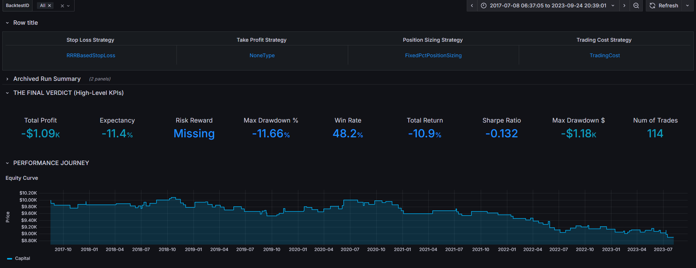
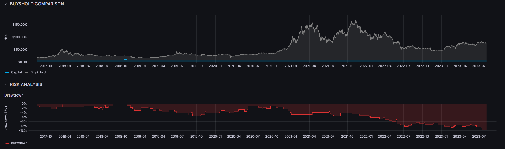
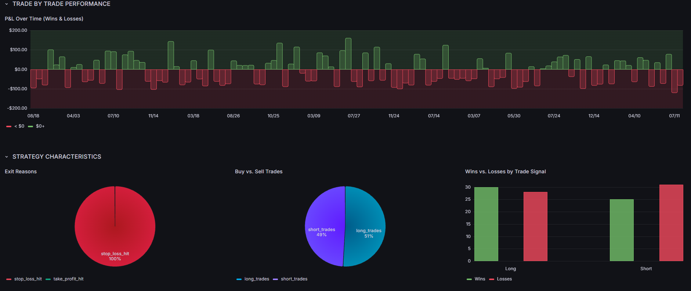
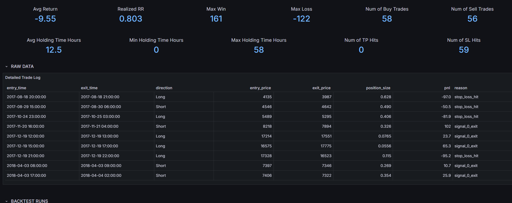
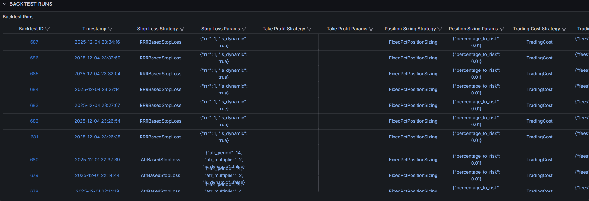

# Modular Event-Driven Backtesting Engine


## 📖 Summary
I built my own backtester because standard Python backtesting libraries have limits and they are not fully customizable.

My goal was to create an engine that combines the speed of **vectorized calculations** (Pandas/NumPy) with the flexibility of an **event-driven loop**. While most beginner backtesters use simple `for` loops, I learned how to map data to NumPy arrays to minimize overhead, allowing for candle-by-candle simulation (needed for Trailing Stops) without waiting to long for results.

This project represents my journey from basic scripts to a **config-driven architecture**. It enforces strict typing (Dataclasses) because I got tired of runtime errors, it integrates **Walk-Forward Optimization** to ensure I'm not just overfitting noise and developing phase of **Machine Learning**.

---

## 🚀 Key Technical Features

### ⚡ Hybrid Execution Engine
* **Vectorized Pre-calculation:** Indicators and patterns are calculated upfront using vectorized operations (Pandas/Ta-Lib) for maximum speed, reducing latency during the simulation phase.
* **NumPy-Optimized Event Loop:** The core loop converts Pandas DataFrames into a dictionary of NumPy arrays. This is a critical optimization that eliminates slow Pandas index lookups during the sequential, candle-by-candle execution, leading to significantly faster backtests.

### 🛠 Config-Driven & Type-Safe Architecture
* Strategies are not hard-coded but defined in **JSON configuration files**. This allows for fast iteration and parameter tuning without touching the code.
* The system uses **Python Dataclasses** to enforce strict schema validation for all parameters (Risk, Signals, Filters), preventing runtime errors due to invalid configurations.

### 🧩 Modular Component Design
The engine follows the **Separation of Concerns** principle. Logic modules are pluggable:
* **Risk Management:** Dynamic modules for Stop Loss (ATR, Trailing, Breakeven), Take Profit, and Position Sizing.
* **Trading Costs:** Integrated `TradingCost` class that simulates **Fees** and **Slippage**. Spread costs are modeled by adjusting slippage dynamically based on volatility.

### 🤖 Optimization & ML Pipeline
* **Walk-Forward Optimization:** integrated **Optuna** to perform Walk-Forward Analysis (WFO). The objective function optimizes for a weighted mix of **Sharpe Ratio** and **Expectancy**, with constraints on the minimum number of trades to ensure statistical significance.
* **Experimental Regime Detection:** Includes a prototype ML pipeline (Decision Trees / XGBoost) designed to classify market regimes (Trending vs. Ranging) to filter trade entries. *Note: This module is currently in the experimental research phase.*.

---

## 📊 Analytics & Visualization

The framework persists trade logs and signal data into a **SQL database**, which feeds into a **Grafana** dashboard for analytics.
### A. Executive Summary & KPIs
Validates strategy edge using metrics (Expectancy, Sharpe Ratio) and visualizes the equity curve.
 
*Figure 1: High-level Key Performance Indicators (KPIs) and Equity Curve.*

### B. Benchmark Comparison & Drawdown
Compares strategy performance against a "Buy & Hold" baseline and visualizes drawdown depth.

*Figure 2: Performance against Market Benchmark and Drawdown analysis.*

### C. Trade Performance & Exit Logic
Analyzes consistency via PnL distribution and classifies exit reasons (e.g., Stop Loss vs. Signal) to verify risk parameters.

*Figure 3: PnL distribution over time and classification of Trade Exit reasons.*

### D. Visual Debugging (Dynamic SL/TP)
Overlays execution logic onto price action, plotting Stop-Loss and Take-Profit levels on chart.

*Figure 4: Visual inspection of trade entries against dynamic SL/TP levels.*

### E. Detailed Trade Log
A row-by-row table of every trade (Entry/Exit times, Prices, PnL) including average holding time analysis.

*Figure 5: Statistical breakdown of holding times and raw trade info.*

### F. Experiment History
SQL-backed log of all simulation runs, preserving parameters and timestamps for full reproducibility.

*Figure 6: Database history of all experiments and configurations.*
---

## 📂 System Architecture

The project is structured to ensure scalability and maintainability:

```text
project_root/
├── config/                     # Configuration & Schemas
│   ├── params_v2.json          # Active strategy configuration
│   └── param_types_v1.py       # Dataclass definitions & Strict Type Validation
├── core/                       # Core Engine Logic
│   ├── backtest_runner.py      # Orchestration of the backtest logic
│   ├── backtest.py             # Optimized NumPy event-loop execution
│   ├── data_preprocessor.py    # Vectorized feature engineering pipeline
│   └── utils.py                # Helper functions (SQL, math, cost calc)
├── indicators/                 # Contains indicators (ma, atr, adx, rsi, ...)
├── patterns/                   # Contains indicators based on market structure (Recent Low/High...)
├── strategies/                 # Strategies, which generate buy, sell and exit signals
├── strategy_components/        # Pluggable Logic Modules
│   ├── stop_loss_strategies.py # Logic for ATR, Trailing, Fixed % SL
│   ├── take_profit_strategies.py
│   ├── position_sizing.py      # Risk management & sizing logic
│   └── trading_cost.py         # Transaction cost per side - fee, slippage (accounting for delay and spread)¸
├── MachineLearning/            # Machine Learning parts, ml_models, trained_artifacts
│   ├── ml_models/              # Contains ml models (linear regression, random forest, ...)
│   ├── trained_artifacts/      # ML Model Persistence
│   └── regime_detection/       # Serialized models (Experimental)
├── data/                       # Data Layer
│   ├── save_load.py            # ETL processes (Binance ingestion)
│   └── files/                  # SQL databases (SQLite) & CSV exports & OHLC data
├── main_v2.py                  # Application Entry Point & Optimization Runner
├── statistical_analysis.py     # Root script for post-backtest statistical analysis
├── README.MD                   # Primary Documentation (This File)
├── DOCUMENTATION.md            # Documentation is outdated and written in Slovene
└── requirements.txt            # Project dependencies

```
---

## 🛠 Tech Stack

* **Language:** Python 3.10.x
* **Core Libraries:** Pandas, NumPy (Heavy optimization)
* **Optimization:** Optuna (Hyperparameter tuning)
* **Technical Analysis:** `ta` library, Custom indicators
* **Data Storage:** SQLite / SQL integration
* **Visualization:** Grafana (via SQL connection)
* **Data Sources:** Historical data via Binance API (Crypto)

---
<br></br>
## 🏃 Getting Started

### Requirements
* Python 3.10.x
* Git

### Installation

1.  **Clone the repository:**
    ```bash
    git clone [https://github.com/JanJu123/Backtester.git](https://github.com/JanJu123/Backtester.git)
    cd Backtester
    ```

2.  **Install dependencies:**
    ```bash
    pip install -r requirements.txt
    ```

### Usage

1.  **Configure Execution (`run_config.py`):**
    Open `config/run_config.py` to set the simulation context. This is the main control center:
    * **Select Strategy:** Set `STRATEGY_TO_RUN` to match the target JSON file in `config/strategies/` (e.g., `"Momentum_zscore_mean_reversion_V2"`).
    * **Select Mode:** Set `MODE` to `"single"` (backtest), `"optimize"` (hyperparameter search), or `"walkforward"` (WFO).

2.  **Define Strategy Parameters:**
    Ensure your strategy's specific parameters (indicators, thresholds, risk rules) are defined in the corresponding JSON file located in `config/strategies/` (e.g., `config/strategies/momentum_zscore_mean_reversion_v2.json`).

3.  **Run Engine:**
    ```bash
    python main_v2.py
    ```
    *The system automatically routes execution based on the `run_config` settings, handling data splitting and result persistence.*

---

## 🔮 Roadmap

My development focus is shifting from pure research towards building a production-grade **Portfolio Execution Engine**.

* [ ] **Strategy Research & Validation (High Priority):**
    * **Immediate Focus:** Utilize the existing backtesting pipeline to research and develope **statistically profitable Mean Reversion strategies** for Crypto or Futures markets (I need to decide for one and focus on one market only).

* [ ] **Portfolio-Level Backtesting:**
    * Extend the architecture to run **multiple strategies on multiple instruments** simultaionsly (e.g., a basket of S&P 500 stocks).
    * Implement aggregated portfolio risk management (e.g., limiting total exposure across correlated assets).
    * Add automated benchmarking against market indices (Buy & Hold SPY) to calculate Alpha.

* [ ] **Futures Support:**
    * Native handling of **Futures Contracts**, including logic for "Continuous Futures".
    * Implementation of **Contract Rolling** logic for live execution (handling expiration and rollover costs).

* [ ] **Live Execution Bridge (Paper/Live):**
    * Build an **Order Management System (OMS)** layer to interface with broker APIs (Interactive Brokers / Binance).
    * State management for real-time order tracking (Open/Filled/Cancelled).


---
*Created by Jan Jurhar. This project demonstrates backend engineering skills applied to quantitative finance.*